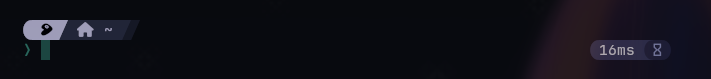
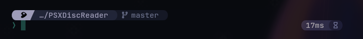
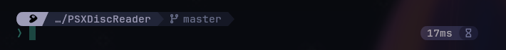

# Starship presets
Some cool hand-made starship presets for your terminal.  
It's pretty minimal. It displays the OS logo, the current directory, the active git branch and its status, and the command duration (there are separated presets without it).

# Previews


## Slashed style with command duration


## Rounded style with command duration


## Arrowed style with command duration


# Getting started
## Requirements
* Install [Starship](https://starship.rs)
* Install a Nerd font, such as [JetBrainsMono Nerd Font](https://github.com/ryanoasis/nerd-fonts)

## Usage
Just copy your toml file of preference to the `~/.config/` directory.
```
cp presets/starship_slashed_cmdtime.toml ~/.config/starship.toml
```
